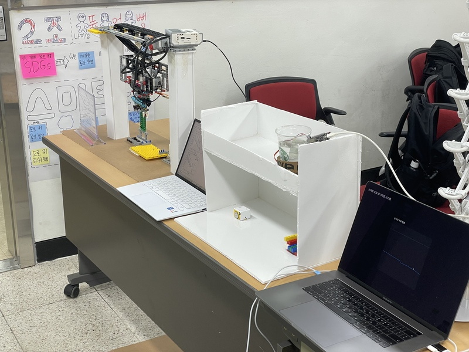
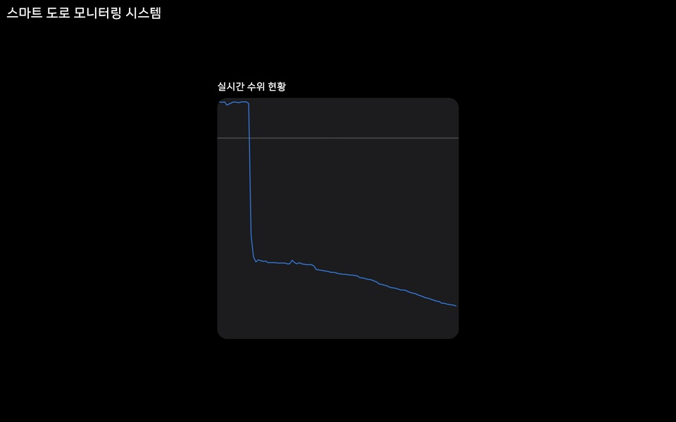
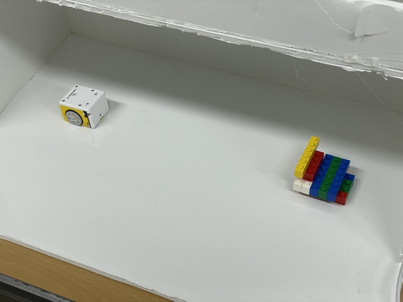

# Ttureoppeong - Smart Road Flood Preventation System with Automatic Sewer Cleaning

[한국어 버전 이용 가능](./README.md)

Gyeonggi-do Goyang Office of Education **2025 AI Make-a-Thon** Project

**｢Unconventional Imagination｣** Award Winner

### Qualifies 3 of 17 UN Sustainable Developemnt Goals(SDGs)1
**6**: Clean Water and Sanitation

**11**: Sustainable Cities and Communities

**13**: Climate Action

## Motivation for Choosing a Topic

Today, climate change is causing more frequent rainy seasons and localized heavy rains, which are increasing the frequency of damage.2

Many roads are also flooded on rainy days due to poor drainage caused by leaves and cigarette stubs in the drains.3

Cleaning the sewer is essential to prevent road flooding and further damage.

This motivated us to develop a solution that automatically manages sewers on roads to prevent them from becoming clogged.

## Identifying the Problem and Setting Goals

### Problem
Leaves, cigarette stubs, trash, etc. clog sewers, increasing the likelihood of road flooding during rainy weather.
→ Disruption of road traffic and safety risks to citizens may occur.

### Problems with Traditional Solutions
The current solution is to manually clean the clogged sewers by hand.
→ This process does not allow for immediate restoration of the drainage system, and the very complex structure of the sewers makes cleaning difficult and inefficient.4

### Setting Goals
We set a goal to build a system that could predict the weather, **proactively clean out sewers that are frequently clogged**, and **detect clogged sewers** and automatically clear them to **keep roads free of flooding**.

### Basic Structure
AI-powered weather prediction → Use small bots to detect clogged sewers → Automatically clean sewers → Use water level sensors to detect clogged sewers in real-time → Automatically clean again if there is a clog

## System Overview

### Weather Prediction AI
AI models trained on weather data predict rainy weather and rainy seasons to proactively clean sewers.

### Real-time Water Level Sensors
A water level sensor installed in a sewer measures the height of the water.
When the sensor's measurement exceeds a certain level, it determines that the sewer is clogged and sends a message to the small bot so that it can move in and diagnose the problem.

### Real-time Monitoring Page
This is a webpage where you can check the values of the water level sensors installed in the sewers in real time.
The values are made into a graph so you can easily see the changes in the values measured by the sensors.

### Small Bot
Small enough to easily navigate sewer pipes, the smallbots go where the weather prediction AI predicts clogging and proactively check for issues in the sewer.
They also go where the water level sensors have called for diagnostics to confirm that the sewer is indeed clogged and ask the cleaning robots to clean it.

### Sewer Cleaning Robot
Sewer cleaning robots are mounted on the ceiling of a sewer and clean the sewer when requested by a smallbot, and unclog it when it's blocked.

## Techn Stack of PoC
We used following technologies on the device for demonstration.

### Weather Prediction AI

An AI that solves the problem of time series weather prediction based on the Jena climate dataset.
It has been preprocessed to resample and normalize the data to increase the accuracy.
LSTM neural network is used as the core model, and the trained model makes predictions on validation data and shows its performance compared to the actual values.

### Real-time Water Level Sensors and Measurement Processing System

We Used an Arduino water level sensor and a NodeMCU board. The NodeMCU is has built-in Wi-Fi capabilities, so we used it to build an IoT system.
The real-time measurements are read by a central server to determine if cleaning is needed and send a diagnostic request message to the smallbot.

### Real-time Monitoring Page

It reads the measured sensor values from a central server and displays them in a graph.
To keep the design as simple as possible, we've removed unnecessary elements and centered the graph.

### Small Bot

We implemented the smallbots using Hamster bot.
A central server handles the movement of the Hamster bot remotely and they move until an obstacle is recognized by the proximity sensor.

### Sewer Cleaning Robot

We implemented a cleaning robot using LEGO MINDSTORMS.
It uses a conveyor belt, a medium cleaning arm, and a suction cleaning device to clean the sewer.

## Additional Ideas
Because all of Ttureoppeong's devices, including the water level sensors, are IoT-enabled, we can
* Build a system that compares information with nearby sewers' water level sensors and sends safety messages to local people when high values are detected in all sewers in a specific area.
* Open APIs to make measurement data available for public use.
* Predicting precipitation based on real-time data measured by water level sensors and visualizing the rainfall on a map.

---

1. SDGs: Sustainable Development Goals. Adopted by the United Nations in 2015 with the goal of ending global poverty, protecting the planet, and ensuring that all people enjoy peace and prosperity by 2030. [지속가능발전목표 | United Nations Development Programme](https://www.undp.org/ko/policy-centre/seoul/sustainable-development-goals)

2. [‘기습폭우’ 장마철 뉴노멀 되나…올해만 벌써 9차례 집중호우](https://www.hani.co.kr/arti/society/environment/1148398.html) - 한겨레 2024. 07. 09.

3. [[패트롤] 무심코 버린 쓰레기 침수를 부른다](https://www.safetimes.co.kr/news/articleView.html?idxno=226798) - 세이프타임즈 2025. 03. 14.

4. ["와, 우리 물 많이 뺐다" 슬리퍼 신고 침수지역 배수구 뚫고 다닌 여중생들](https://www.safetimes.co.kr/news/articleView.html?idxno=226798) - 아시아경제 2023. 07. 24.