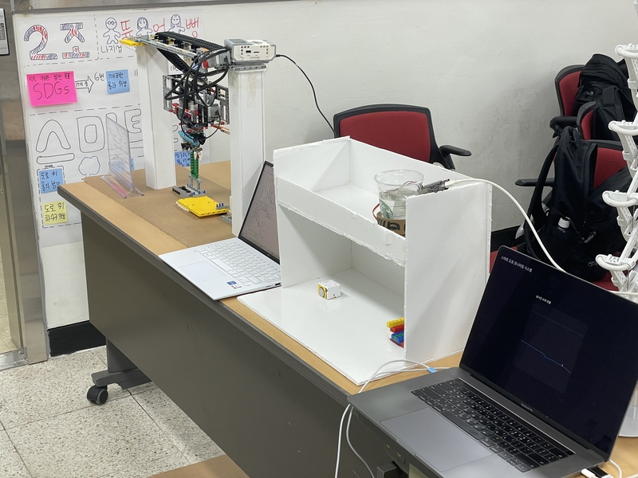
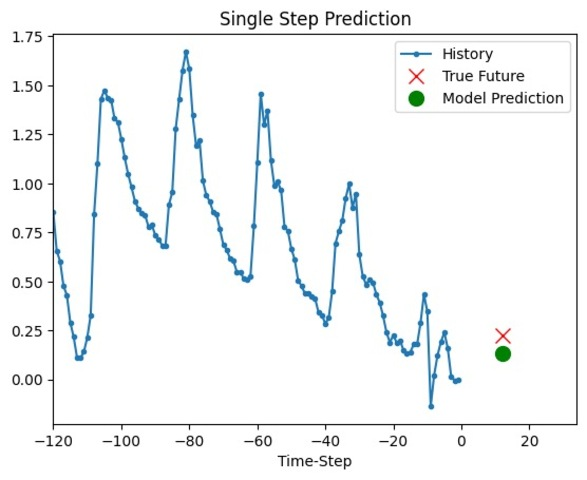
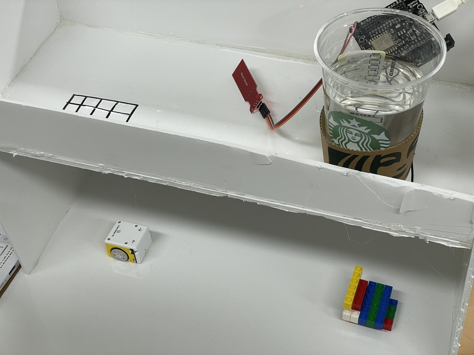
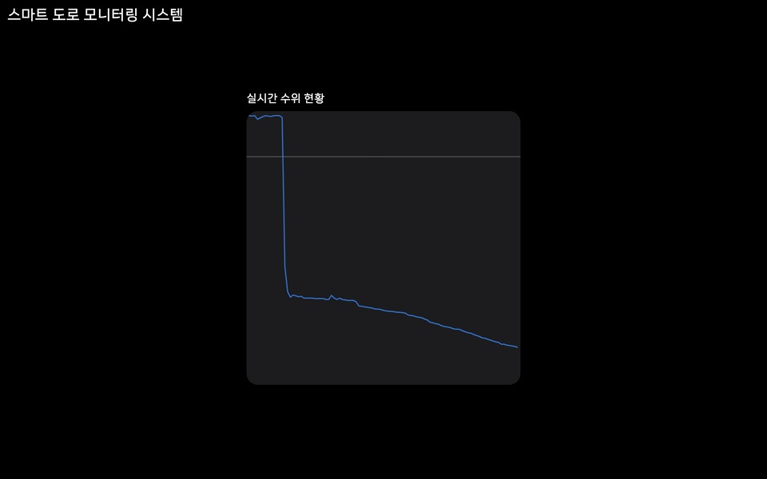
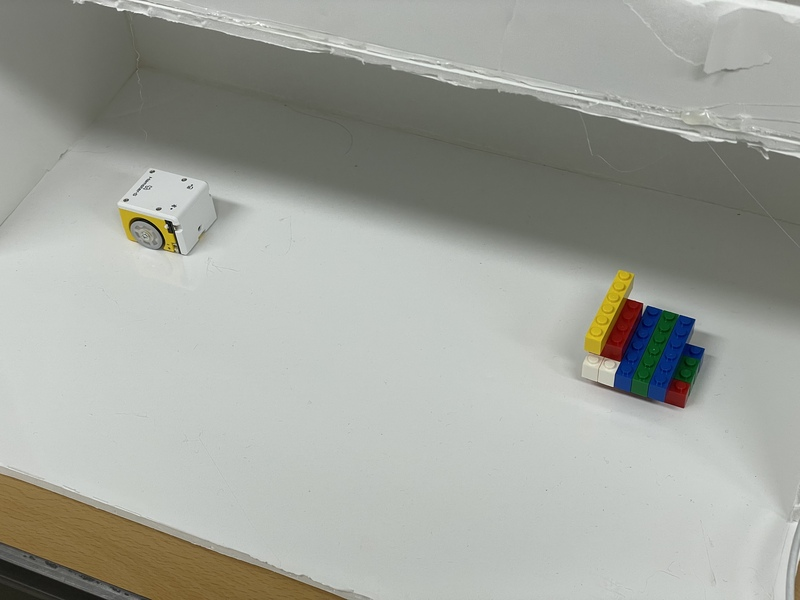
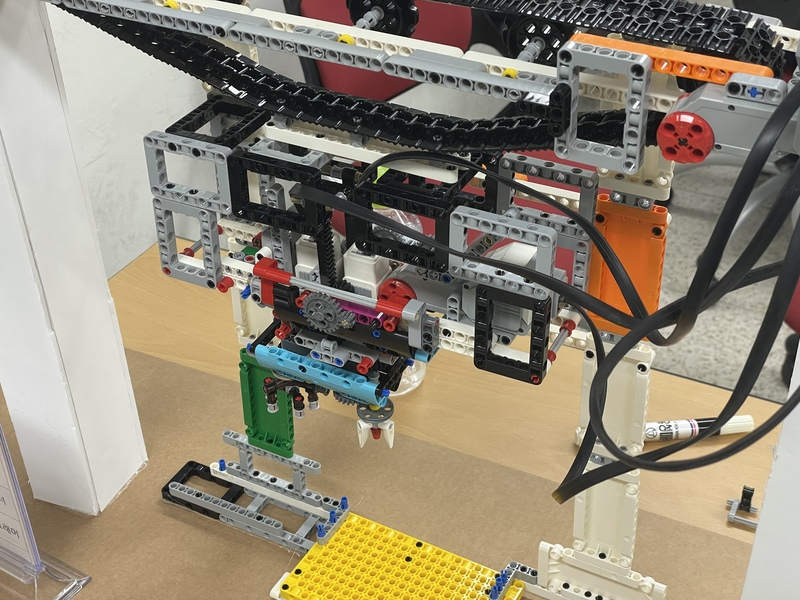

# 뚫어뻥 - 하수구 자동 청소를 통한 스마트 도로 침수 방지 시스템

경기도고양교육지원청 **2025 고교연합 인공지능 메이커톤** 프로젝트

**｢틀을 깬 상상｣** 상 수상작

### UN 지정 지속가능발전성목표(SDGs)1 17개 중 3가지 만족
**6**: 깨끗한 물과 위생

**11**: 지속가능한 도시와 공동체

**13**: 기후변화 대응

## 주제 선정 동기
오늘날 기후 변화로 인해 장마나 국지성 호우가 잦아져 피해 빈도가 증가하고 있습니다.2

하수구에 낙엽과 담배꽁초 등이 들어가 배수가 원활하지 못해 비 오는 날 도로가 물에 잠기는 문제 또한 많이 발생하고 있습니다.3

이처럼 도로 침수와 그로 인한 추가적인 피해를 막기 위해서는 하수구 청소가 필수적입니다.

이에 우리는 도로의 하수구가 막히지 않도록 자동으로 관리해 주는 솔루션을 개발하게 되었습니다.

## 문제 정의 및 목표 설정

### 문제
낙엽, 담배꽁초, 쓰레기 등으로 하수구가 막혀 우천 시 도로의 침수 가능성이 증가합니다.
→ 도로 교통 방해 및 시민들의 안전 위험이 발생할 우려가 있습니다.

### 기존 대책의 문제점
현재의 해결책은 막힌 하수구를 사람이 직접 수작업으로 청소하는 데 머무르고 있습니다.
→ 이러한 과정은 배수 시스템의 즉각적인 복구가 불가능하고, 하수구 구조가 매우 복잡해 청소의 난이도가 높고 비효율적입니다.4

### 목표 설정
날씨 예측을 통해 **상습적으로 막히는 하수구를 사전에 청소**하고, **막힌 하수구를 감지**하여 자동으로 하수구를 청소해 **도로가 침수되지 않은 상태를 유지**할 수 있도록 하는 시스템을 구축하는 것을 목표로 설정했습니다.

### 기본 구조
AI 기반 날씨 예측 → 스몰봇을 이용하여 막힌 하수구 탐색 → 하수구 자동 청소 → 수위 센서를 사용하여 막힌 하수구를 실시간으로 감지 → 막힌 하수구가 있다면 다시 자동 청소

## 시스템 상세 설명

### 날씨 예측 AI
날씨 데이터를 통해 학습한 AI 모델은 우천과 장마를 예측하여 사전에 하수구 청소 작업을 시행합니다.

### 실시간 수위 감지 센서
하수구에 설치된 수위 감지 센서는 물의 높이를 측정합니다.
센서에 측정된 값이 일정 수준을 넘어서면 하수구가 막힌 것으로 판단하고, 스몰봇이 이동하여 해당 하수구를 진단할 수 있도록 메시지를 전송합니다.

### 모니터링 페이지
하수구에 설치된 수위 감지 센서의 값을 실시간으로 확인할 수 있는 페이지입니다.
측정값을 그래프로 표시해 센서에 측정된 값의 변화를 쉽게 확인할 수 있습니다.

### 스몰봇
작은 크기로 하수관을 쉽게 이동할 수 있는 스몰봇은 날씨 예측 AI가 막힐 것으로 예상한 곳으로 이동해 하수구의 이상을 미리 확인합니다.
또한 수위 감지 센서가 진단을 요청한 곳으로 이동해 하수구가 실제로 막힌 것인지를 확인하고 청소 로봇에게 청소를 요청합니다.

### 하수구 청소 로봇
하수구 청소 로봇은 하수구의 천장에 설치되어 스몰봇의 요청을 받으면 하수구를 청소하고, 하수구가 막혔을 때 뚫는 기능을 합니다.

## PoC 기술 스택

시연을 위해 제작한 장치에서 다음과 같은 기술을 사용했습니다.

### 날씨 예측 AI

Jena 기후 데이터셋 기반으로 시계열 온도 예측 문제를 해결하는 AI입니다.
예측 정확도를 높이기 위해 데이터를 리샘플링하고 정규화하는 전처리 과정을 거쳤습니다.
핵심 모델로 LSTM 신경망이 사용되며, 훈련된 모델은 검증 데이터에 대한 온도 예측을 수행하고 실제 값과 비교하여 성능을 보여줍니다.

### 실시간 수위 감지 센서 및 측정값 처리 시스템

아두이노 수위 감지 센서와 NodeMCU 보드를 사용했습니다. NodeMCU는 Wi-Fi 기능이 내장된 것이 특징으로, 이를 이용해 IoT 시스템을 구축했습니다.
실시간으로 측정된 값을 중앙 서버에서 읽어와 청소가 필요한지 판단하고 스몰봇에게 진단 요청 메시지를 전송합니다.

### 모니터링 페이지

중앙 서버에서 측정된 센서 값을 읽어와 그래프로 표시합니다.
최대한 간결한 디자인을 위해 불필요한 요소를 제거하고 그래프를 중앙에 배치했습니다.

### 스몰봇

햄스터봇을 이용하여 스몰봇을 구현했습니다.
중앙 서버에서 스몰봇의 이동을 처리하며 근접 센서에 장애물이 인식될 때까지 이동합니다.

### 하수구 청소 로봇

LEGO MINDSTORMS를 이용해 청소 로봇을 구현했습니다.
컨베이어 벨트, 미디엄 청소팔, 흡입 청소 장치를 이용해 하수구의 위아래를 오가며 청소합니다.

## 발전 방향 제시
수위 센서를 포함한 뚫어뻥의 모든 장치는 IoT 기능을 갖추었기 때문에
* 주변 하수구들과 정보를 비교해 특정 지역의 하수구 수위 센서에서 모두 높은 값이 감지되면 지역 사람들에게 안전안내문자를 전송하는 시스템 구축
* 측정 데이터를 OpenAPI로 개방해 민간에서 활용할 수 있는 환경 조성
* 수위 센서에 실시간으로 측정된 데이터를 기반으로 강수량을 예측하고, 어느 지역에 비가 많이 오는지 지도에 시각화

등 여러 방향으로 활용이 가능할 것으로 보입니다.

---

1. SDGs: Sustainable Development Goals. 전 세계 빈곤을 종식시키고 지구를 보호하며, 2030년까지 모든 사람들이 평화와 번영을 누릴 수 있도록 보장하기 위한 목표로 2015년 UN에 의해 채택되었습니다. [지속가능발전목표 | United Nations Development Programme](https://www.undp.org/ko/policy-centre/seoul/sustainable-development-goals)

2. [‘기습폭우’ 장마철 뉴노멀 되나…올해만 벌써 9차례 집중호우](https://www.hani.co.kr/arti/society/environment/1148398.html) - 한겨레 2024. 07. 09.

3. [[패트롤] 무심코 버린 쓰레기 침수를 부른다](https://www.safetimes.co.kr/news/articleView.html?idxno=226798) - 세이프타임즈 2025. 03. 14.

4. ["와, 우리 물 많이 뺐다" 슬리퍼 신고 침수지역 배수구 뚫고 다닌 여중생들](https://www.safetimes.co.kr/news/articleView.html?idxno=226798) - 아시아경제 2023. 07. 24.